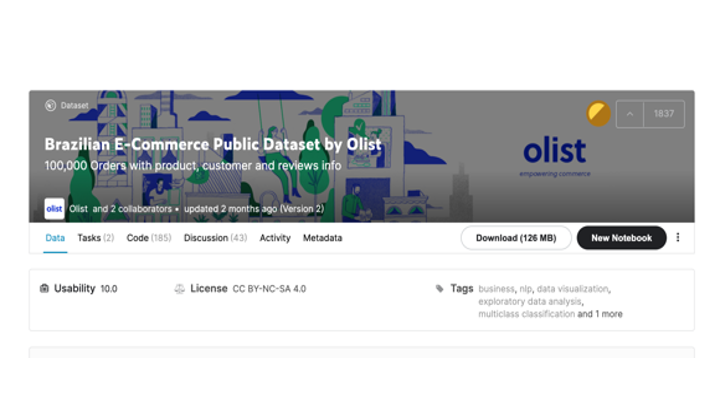

**Analytics Workshop - Fintech Forum, 2021**

1. We first create a model in [Amazon SageMaker](https://docs.aws.amazon.com/sagemaker/index.html). The model we create is using [K-Means built-in algorithm](https://docs.aws.amazon.com/sagemaker/latest/dg/k-means.html) available with Amazon SageMaker.
2. One of the key aspects of effectively personalizing the customer's experience is the ability to flawlessly and frictionlessly presenting customers hyper-relevant offers. [Research by Accenture and Nomis](https://www.accenture.com/_acnmedia/accenture/conversion-assets/dotcom/documents/global/pdf/dualpub_20/accenture-retail-bank-pricing-survey.pdf) suggests that fintechs that link pricing to customer lifetime value (CLV) will be better positioned for growth and prosperity.
3. One of the most important processes in determining CLV is the ability to segment your customers. Recency, Frequency, Monetary (RFM) segmentation enables personalized marketing, increases engagement, and enables you to create specific, relevant offers for the right groups of customers. 
4. We will be performing RFM analysis, the approach can be leveraged in banking, especially mobile banking where customers often also engage with merchants through the bank's mobile app, typical inputs to such an analysis may include deposit type, transaction date, balance before transaction, transaction amount etc.. It can also be leveraged with insurance where the input data may include demographic details, term of policy, sum assured, premium, agent etc. [This is a paper that covers various techniques in depth](https://farapaper.com/wp-content/uploads/2019/06/Fardapaper-Customers-Segmentation-in-the-Insurance-Company-TIC-Dataset.pdf).
5. We will be using [this dataset](https://www.kaggle.com/carrie1/ecommerce-data) for this lab. You can also get this dataset [here](https://archive.ics.uci.edu/ml/datasets/online+retail). These datasets will serve as an analogy for banking, insurance etc. and you will have to come up with your corresponding inputs for RFM analysis.
6. Download the dataset and copy this to an S3 location in your lab environment.
    * Click on [this link](https://www.kaggle.com/carrie1/ecommerce-data), this should take you to the page on kaggle.com. 
    * Use the download link to download the dataset to your computer.
    
    * Run the following command to create the S3 bucket required to upload the dataset and the KMS key required to encrypt it at rest.
    ```
    aws cloudformation create-stack --stack-name step-1-stack --template-body file://step-1.yml --parameters ParameterKey=TeamRoleArn,ParameterValue=<ARN of the IAM role TeamRole from the lab environment>
    ```
    * Either upload the downloaded dataset file using the S3 console to the bucket we just created or run the following command,
    ```
    aws s3 cp <location of dataset file> s3://<bucket-name>[/<optional prefix>]
    ```
    Look at the __Outputs__ of the above created stack to get the bucket name. You can choose the prefix. 
7. Launch an Amazon Redshift cluster. Use the step-2.yml cloudformation template. 
    ```
    aws cloudformation create-stack --stack-name step-1-stack --template-body file://step-2.yml --parameters ParameterKey=TeamRoleArn,ParameterValue=<ARN of the IAM role TeamRole from the lab environment>
    ```
8. 